# MobileSoftware
## 모바일소프트웨어 최종 과제 다이어리앱 (2023년 1학기)

 
 
<h2>초기 실행 화면 (전체 항목 보기) </h2>
<ul>
    <li> 초기 화면 </li>
    <li> 메뉴 버튼 클릭 </li>
</ul>
 

  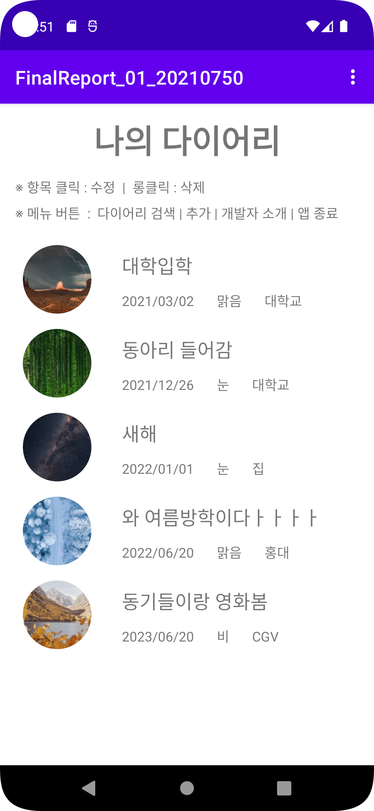
  <a> &nbsp </a>
  <a> &nbsp </a>
  <a> &nbsp </a>
  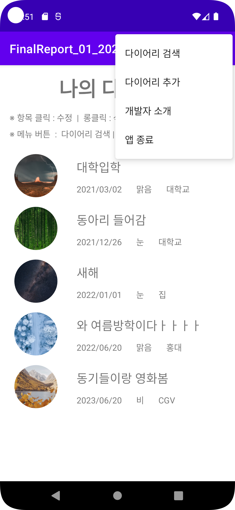

 
 

<h2> 다이어리 추가 </h2>

<b> 메뉴 - 다이어리 추가 클릭 </b>

<ul>
    <li> 다이어리 추가 초기 화면 </li>
    <li> 제목 미입력 </li>
    <li> 다이어리 추가 취소 </li>
    <li> 다이어리 추가 완료 </li>
</ul>
 

  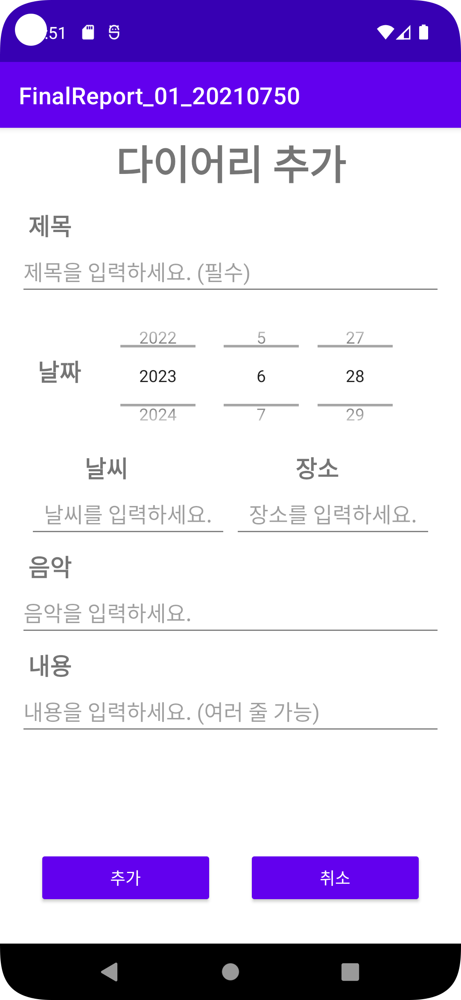
  <a> &nbsp </a>
  <a> &nbsp </a>
  <a> &nbsp </a>
  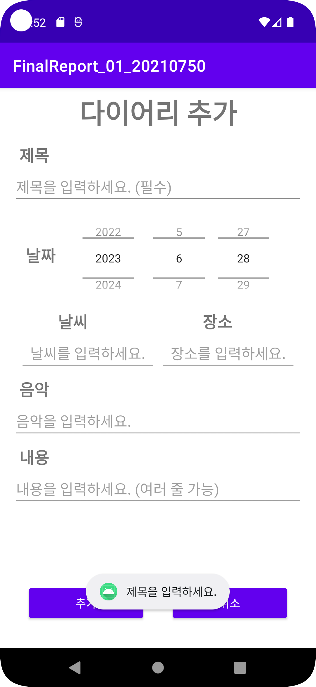
  <a> &nbsp </a>
  <a> &nbsp </a>
  <a> &nbsp </a>
   
  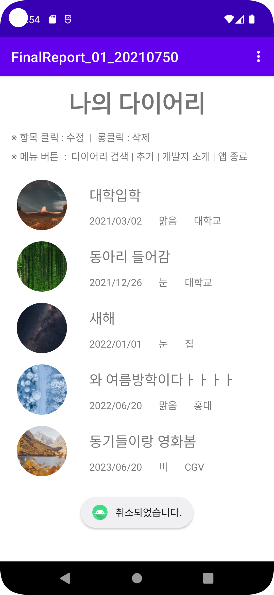
  <a> &nbsp </a>
  <a> &nbsp </a>
  <a> &nbsp </a>
  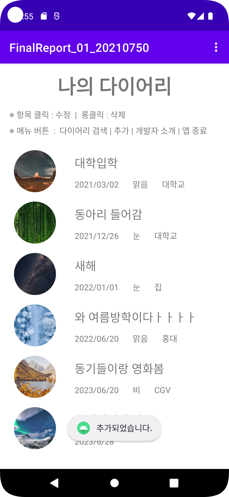

 
 

<h2> 다이어리 수정 </h2>

<b> 항목 클릭 </b>

<ul>
    <li> 다이어리 수정 초기 화면 </li>
    <li> 제목 미입력 </li>
    <li> 다이어리 수정 취소 </li>
    <li> 다이어리 수정 완료 </li>
</ul>
 

  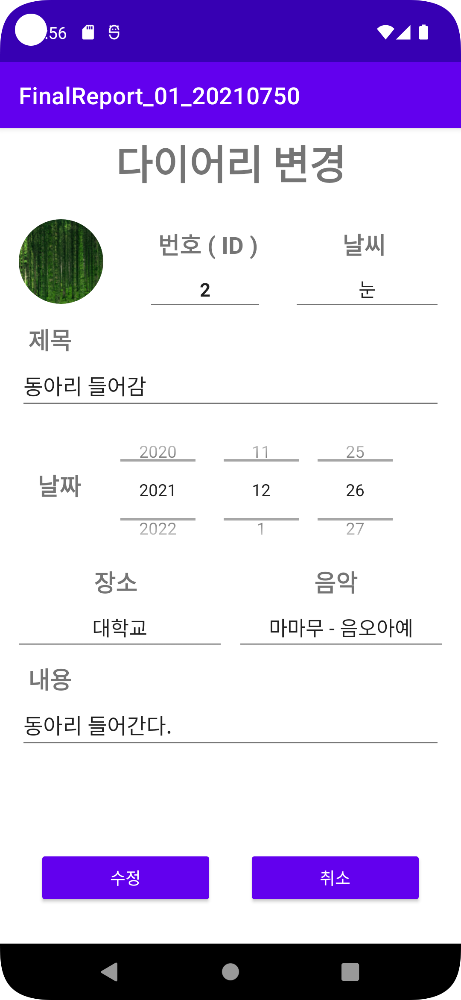
  <a> &nbsp </a>
  <a> &nbsp </a>
  <a> &nbsp </a>
  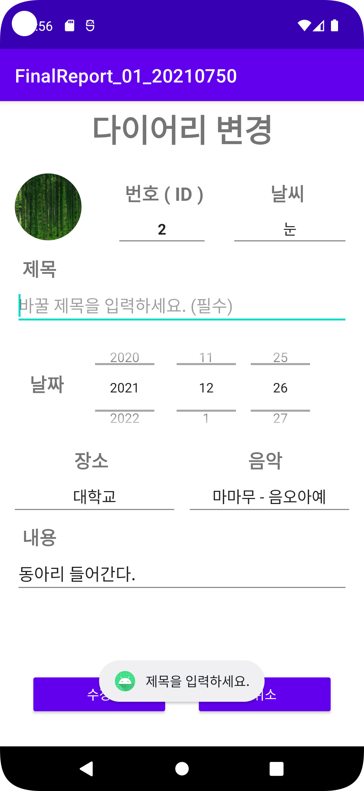
  <a> &nbsp </a>
  <a> &nbsp </a>
  <a> &nbsp </a>
   
  
  <a> &nbsp </a>
  <a> &nbsp </a>
  <a> &nbsp </a>
  

 
 

<h2> 다이어리 삭제 </h2>

<b> 항목 롱클릭 </b>

<ul>
    <li> 다이어리 삭제 대화상자 </li>
    <li> 다이어리 삭제 완료 </li>
</ul>
 

  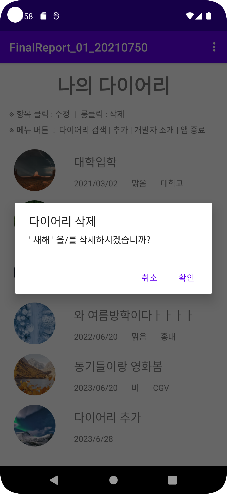
  <a> &nbsp </a>
  <a> &nbsp </a>
  <a> &nbsp </a>
  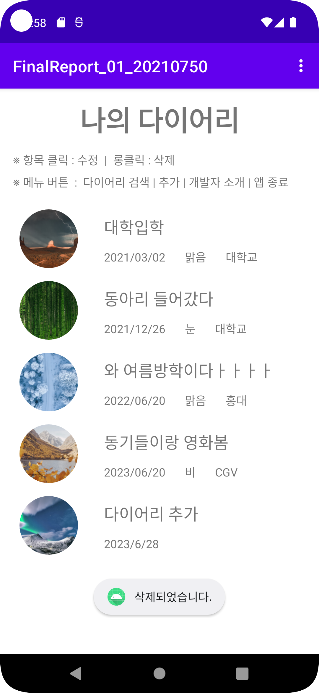

 
  

<h2> 다이어리 검색 </h2>

<b> 메뉴 - 다이어리 검색 클릭 </b>

<ul>
    <li> 다이어리 검색 초기 화면 </li>
    <li> 없는 제목 입력 </li>
    <li> 있는 제목 입력 </li>
</ul>
 

  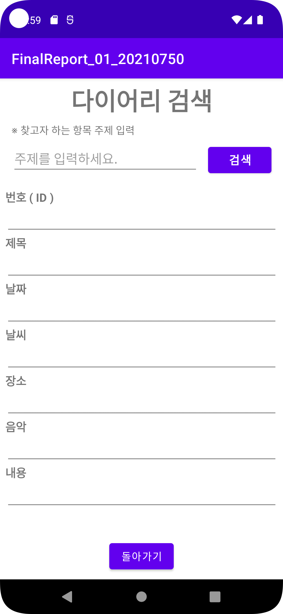
  <a> &nbsp </a>
  <a> &nbsp </a>
  <a> &nbsp </a>
  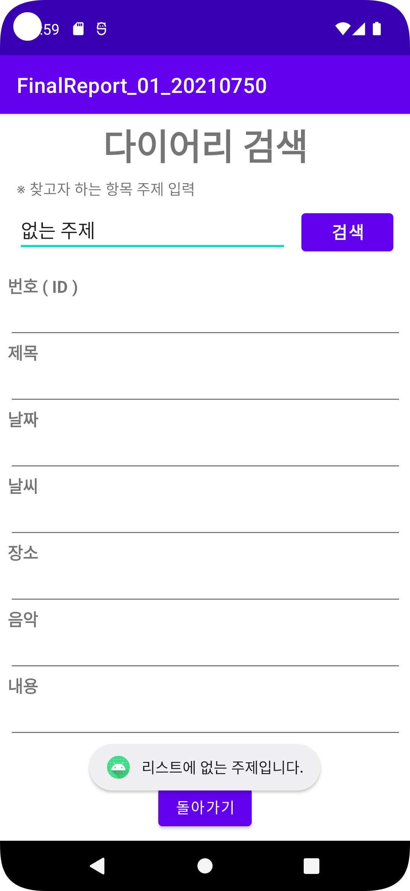
  <a> &nbsp </a>
  <a> &nbsp </a>
  <a> &nbsp </a>
  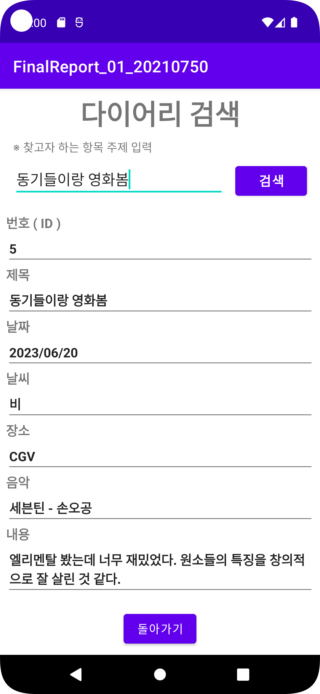

 
 

<h2> 다이어리 앱 종료 </h2>

<b> 메뉴 - 앱종료 클릭 </b>

<ul>
    <li> 다이어리 앱 종료 대화상자 </li>
</ul>
 

  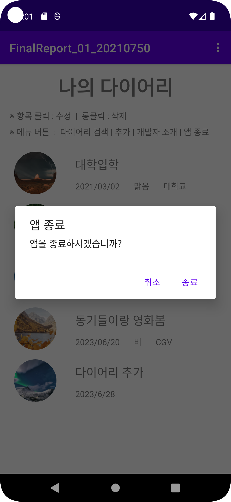

 
 
